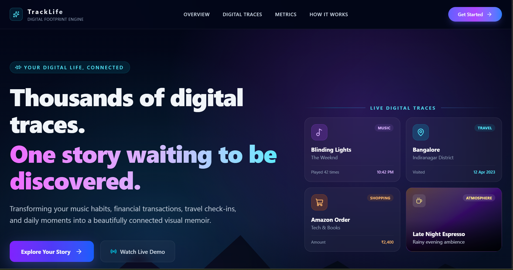
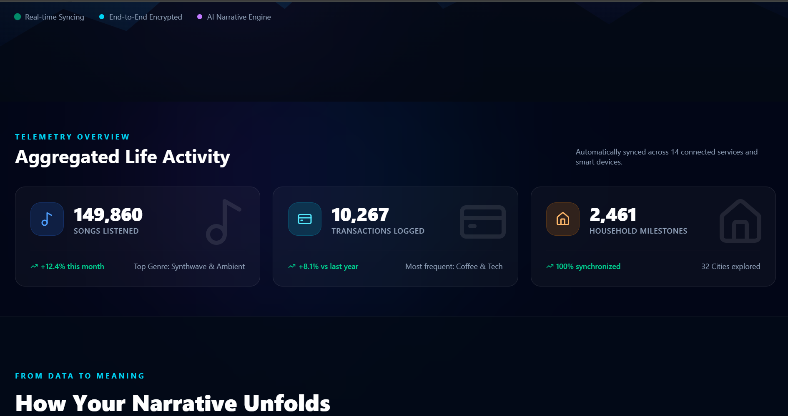
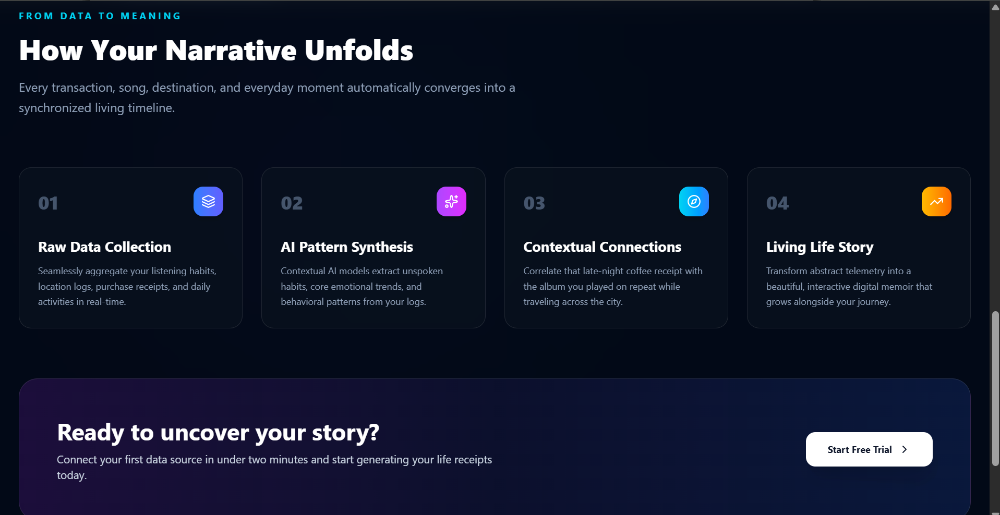
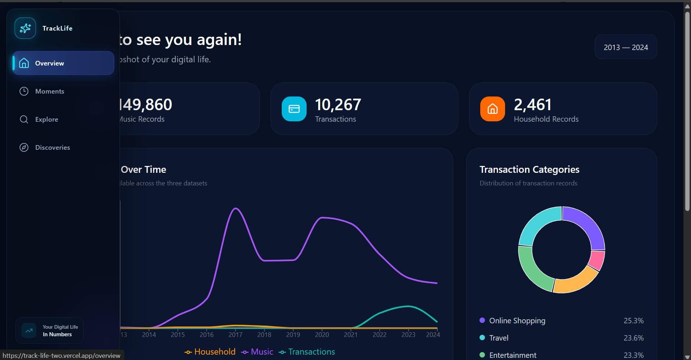
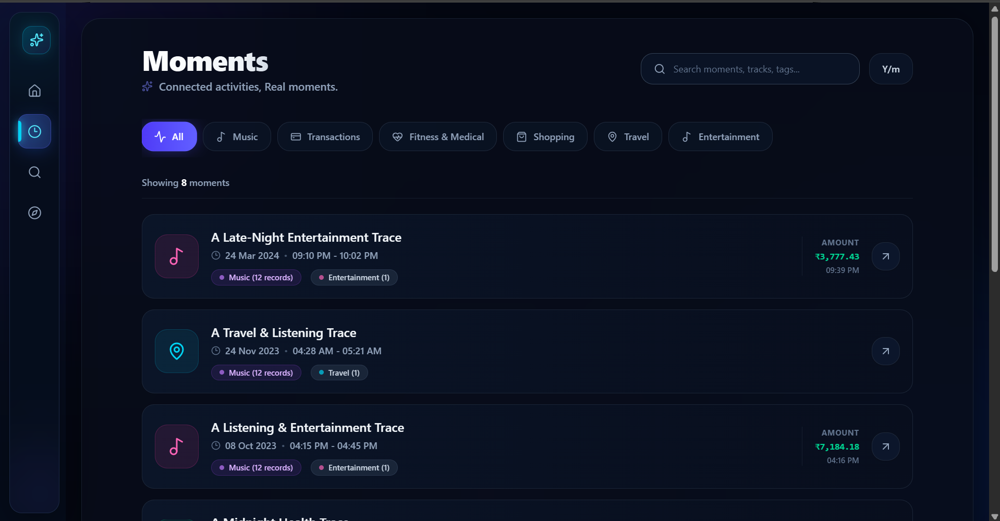
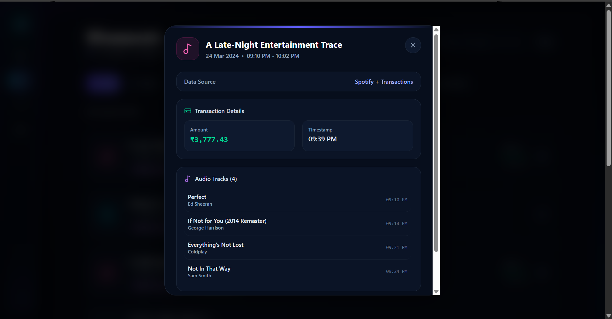
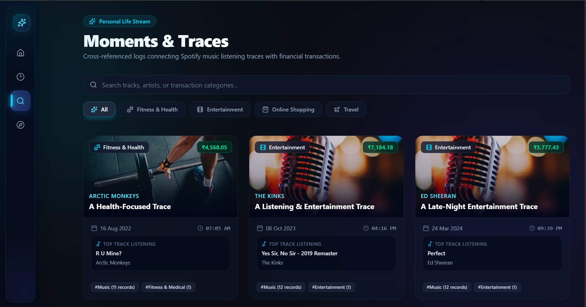
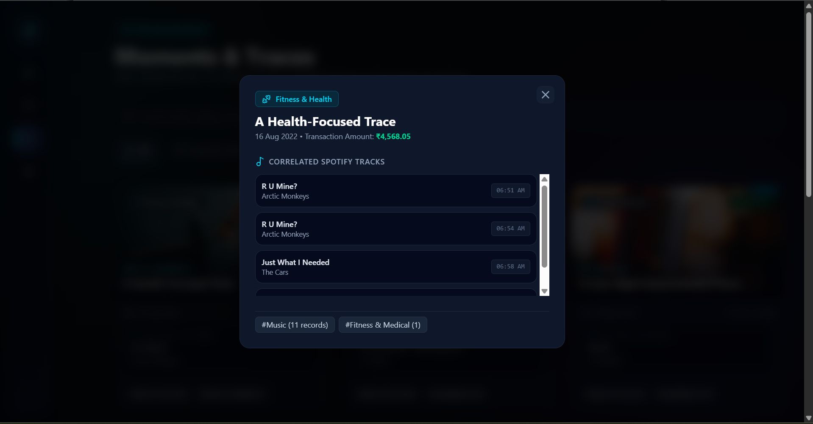
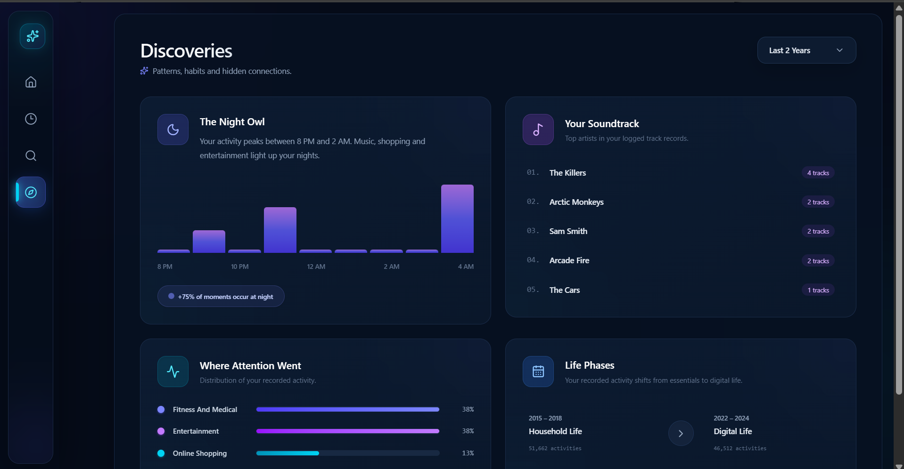

# 🧾 DigiTrace

> **A digital life reconstructed from the moments left behind.**

DigiTrace(DigitalTrace) is a frontend-only interactive data experience that transforms raw digital activity into **patterns, connections, discoveries, and moments**.

Instead of simply displaying thousands of records as tables or charts, DigiTrace explores how different traces — such as music listening and transactions — can appear together in time and turns those observable patterns into an interactive story.

---

## 🎯 Problem Statement

Large datasets can contain thousands of individual records, but raw records alone do not communicate much meaning.

For example:

```text
Spotify Record
2023-10-08 16:17
The Beatles

Transaction
2023-10-08 16:16
Entertainment
₹7,184

When viewed independently, these records provide limited context.

DigiTrace explores whether such traces can be connected through:

Time proximity
Categories
Repetition
Activity patterns
Cross-dataset relationships

The goal is to transform isolated records into a more understandable and interactive representation of activity.

💡 Core Idea
Digital activity leaves behind small traces.

A song was played
       ↓
A transaction happened
       ↓
Both happened around the same time
       ↓
A potential connection is detected
       ↓
The connection becomes a "Moment"
       ↓
Multiple moments reveal patterns
       ↓
Patterns become "Discoveries"
       ↓
The user explores the resulting story

The main concept of DigiTrace is:

Raw Data → Insights → Connections → Moments → Discoveries → Story

Instead of only showing individual records, the project explores how those records can be viewed together.

📊 Datasets
DigiTrace works with multiple activity datasets.

🎵 Spotify Listening History
The Spotify dataset contains music listening activity across multiple years.

Relevant fields include:
Timestamp
Track name
Artist
Album
Playback information
Skip information

The dataset contains approximately 149,860 music records.

It is used to explore:
Listening activity
Frequently appearing artists
Listening time patterns
Temporal relationships with other activities

💳 Transaction Dataset
The transaction dataset contains approximately 10,267 transaction records covering the available 2022–2024 period.
Relevant information includes:
Transaction timestamp
Category
Amount
Merchant/activity information
Location-related information where applicable

The available categories include:

Online Shopping
Travel
Entertainment
Fitness & Medical

Selected non-sensitive fields are used for visualization and pattern detection.

🏠 Daily Household Transactions
The household dataset contains approximately 2,461 records covering the available 2015–2018 period.
It contains different types of household financial activity such as:
Food
Transportation
Household
Subscription
Health
Investment
Family
Apparel
Money Transfer
Income
Other activities

This dataset represents an earlier period and is treated as a separate data era rather than being assumed to be directly synchronized with the 2022–2024 datasets.

⚙️ Data Processing
The application converts raw records into a common activity-oriented structure.
The general processing flow is:

Raw Dataset
     ↓
Timestamp Extraction
     ↓
Activity Normalization
     ↓
Category / Type Identification
     ↓
Temporal Comparison
     ↓
Pattern Detection
     ↓
Connected Activities
     ↓
Moments
     ↓
Discoveries

Different data sources are represented as activity records so they can be explored together.

For example, a music record can be represented as:

{
  source: "spotify",
  type: "music",
  timestamp: "...",
  title: "Track Name",
  subtitle: "Artist Name"
}

A transaction can be represented as:

{
  source: "transaction",
  type: "purchase",
  timestamp: "...",
  title: "Entertainment",
  subtitle: "Merchant Name"
}

This common representation allows activities from different datasets to be compared based on their observable properties.

🔗 Connection Methodology
One of the core concepts of DigiTrace is temporal connection detection.

⏱️ Temporal Connection
Activities occurring within a defined 30-minute time window can be grouped as a potential connection.

Conceptually:

Activity A
    │
    │  ≤ 30 minutes
    ▼
Activity B
    │
    ▼
Potential Connection

For example:

09:10 PM
🎵 Perfect — Ed Sheeran

09:14 PM
🎵 If Not for You — George Harrison

09:21 PM
🎵 Everything's Not Lost — Coldplay

09:39 PM
💳 Entertainment transaction
₹3,777

These activities occur within the same observed time window and can therefore be presented together as a Moment.

🧩 Moments

Moments are the core storytelling feature of DigiTrace.

Instead of displaying individual records separately, the application groups activities based on observable temporal relationships.

A Moment can contain:

Music Activity
      +
Transaction Activity
      +
Time Relationship
      ↓
Connected Moment

Each Moment presents the activities that contributed to the detected connection.

Users can explore the individual traces behind each Moment.


⚠️ Connection Does Not Mean Causation
A temporal connection does not mean that one activity caused another.
For example:

Music played
      +
Transaction occurred nearby in time
      ↓
Observed temporal connection

It does not mean:

Music played
      ↓
Caused
      ↓
Transaction

DigiTrace therefore describes these relationships as:
Potential connections
Observed patterns
Temporal relationships
Detected moments rather than causal conclusions.

🚀 Features
📊 Overview:
The Overview page provides a high-level view of the available datasets.

It includes:

Total music records
Total transaction records
Household records
Activity visualizations
Transaction category breakdown
Recent connected moments
The purpose is to give users an immediate understanding of the scale and structure of the available data.

🧩 Moments:
The Moments section is the core storytelling experience.

The application identifies activities occurring within the defined temporal window and presents them together as a potential Moment.

Users can:
Browse connected moments
View the activities inside a moment
See the time relationship between activities
Explore the underlying traces

🔍 Explore:
The Explore section allows users to investigate the available activity data.

Users can explore:
Music
Transactions
Categories
Artists
Dates
Activity records

Search and filtering help users move from the high-level story back to the underlying data.

Story
  ↓
Moment
  ↓
Individual Records
💡 Discoveries

Discoveries transform individual records and moments into higher-level observable patterns.

🌙 The Night Owl:
Highlights recurring activity during late evening and overnight hours.

🎵 Your Soundtrack:
Shows artists that appear frequently in the available Spotify listening history.

💳 Where Attention Went:
Shows how transaction activity is distributed across available categories.
Discoveries are descriptive patterns found in the supplied datasets. They do not claim to explain personal intent, emotions, or causation.

🏗️ Application Architecture:
DigiTrace is organized around different stages of data exploration.

                     DigiTrace
                         │
          ┌──────────────┼──────────────┐
          │              │              │
       Overview        Explore        Moments
          │              │              │
          └──────────────┼──────────────┘
                         │
                    Discoveries
                         │
                         ↓
                    Data Story

Overview:
Provides high-level statistics and visual summaries.

Explore:
Provides access to underlying activity records.

Moments:
Connects activities using observable temporal relationships.

Discoveries:
Highlights higher-level patterns derived from the available data.

📁 Project Structure
A simplified structure of the project:
src/
│
├── components/
|      └── Sidebar.jsx
│
├── layout/
│   ├── AppLayout.jsx
│  
│
├── pages/
│   ├── Landing.jsx
│   ├── Overview.jsx
│   ├── Moments.jsx
│   ├── Explore.jsx
│   └── Discoveries.jsx
│
├── routes/
│   └── AppRoutes.jsx
│
└── ...

public/
└── data/
    ├── overviewData.json
    ├── momentsData.json
    └── ...
🖥️ Frontend Architecture

DigiTrace is completely frontend-only.

The project does not require:
A backend server
An external database
Server-side application logic

The application works with static/local data and processes the required information within the frontend.

The frontend is responsible for:
Loading data
Processing activity records
Detecting defined patterns
Creating connected moments
Generating visualizations
Providing search and filtering
Presenting the interactive story

🛠️ Technology Stack
React.js:
Used to build reusable UI components and application pages.

Vite:
Used as the development and production build environment.

Tailwind CSS:
Used for responsive styling and the dark data-exploration interface.

React Router:
Used for navigation between:
Overview
Moments
Explore
Discoveries

GSAP:
Used for page-entry animations and interaction effects.

Recharts:
Used to visualize activity and category patterns through charts.

Lucide React:
Used for consistent interface icons throughout the application.

🎨 UI / UX Design
The interface is designed around the idea of exploring a digital life archive.

The visual experience focuses on:
Dark interface
Data-focused cards
Clear information hierarchy
Interactive navigation
Subtle animations
Responsive layouts
Story-oriented presentation

Instead of presenting the data as a traditional analytics dashboard, DigiTrace aims to make the user feel like they are exploring traces and moments from a larger digital story.

📱 Responsive Design
DigiTrace is designed to adapt to different screen sizes.
The interface is intended to remain usable across:
Desktop
Laptop
Tablet
Mobile-sized screens
🔒 Data & Privacy

The project uses supplied datasets as the basis for the experience.
Only the fields required for visualization, exploration, and pattern detection are intended to be exposed through the interface.
Sensitive or unnecessary personal fields are not intended to be displayed as part of the user experience.

⚠️ Limitations

DigiTrace has several important limitations.

1. Temporal proximity is not causation
Two activities occurring near each other in time does not prove that they are related.

2. Rule-based connections
The current connection mechanism relies on predefined observable rules rather than understanding personal context.

3. Different dataset periods
The datasets do not all cover the same time period.

Household Transactions
2015–2018

Spotify + Transaction Activity
2022–2024

Therefore, these datasets should not automatically be interpreted as synchronized records from the same period.

4. Limited context
A timestamp and category can show that something happened, but they cannot reliably explain the user's intention or emotional state.

5. Pattern interpretation
Discoveries describe patterns present in the supplied data. They should not be interpreted as definitive explanations of a person's life or behavior.

🔮 Future Scope

Possible future improvements include:
More advanced cross-dataset relationship detection
Additional activity datasets
User-configurable connection windows
More sophisticated pattern detection
Interactive relationship graphs
More detailed story chapters
Additional filtering and exploration controls
Exportable data stories
More advanced visual analytics

These are potential future directions and are not represented as current functionality.

🚀 Getting Started
Prerequisites

Make sure you have:

Node.js installed
npm installed
Git installed
Installation

Clone the repository:

git clone <YOUR_GITHUB_REPOSITORY_URL>

Move into the project directory:

cd digitrace

Install dependencies:

npm install

Start the development server:

npm run dev

Vite will provide a local development URL in the terminal.


🌐 Live Demo:
Live Project:
https://track-life-two.vercel.app/

GitHub Repository:
https://github.com/hsjadon0508/TrackLife

📸 Screenshots:
Landing Page




Overview


Moments



Explore



Discoveries



🏆 Hackathon Concept

DigiTrace was created around the idea of transforming raw activity data into an interactive digital story.
The central concept is:
Don't just visualize the records. Connect the traces and let the user explore the story they form.
The project focuses on the transition:
Raw Data
    ↓
Insights
    ↓
Connections
    ↓
Moments
    ↓
Discoveries
    ↓
Story
The goal is not to invent a story from the data, but to make observable relationships within the data easier to explore and understand.

👨‍💻 Built With
React.js · Vite · Tailwind CSS · React Router · GSAP · Recharts · Lucide React

📌 Final Note
DigiTrace treats data as a collection of traces rather than isolated rows.
By combining exploration, rule-based pattern detection, temporal connections, visualization, and interactive storytelling, the project creates a way to move from thousands of raw records toward a more understandable view of the activity they represent.
